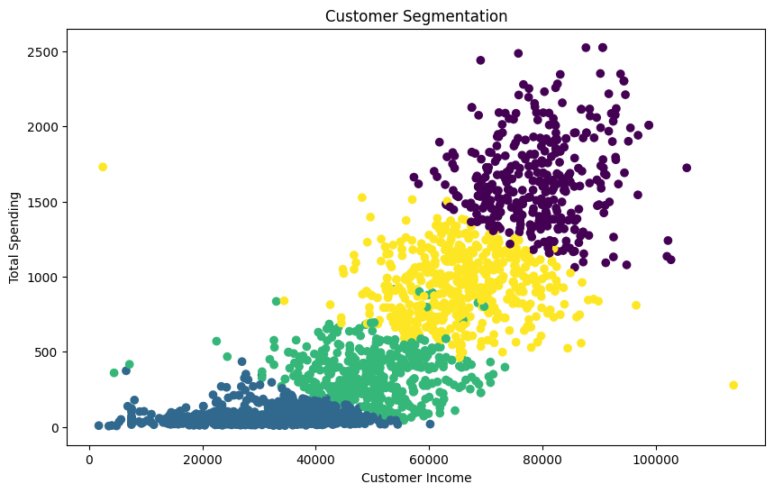

# Customer Segmentation Analysis

## Project Overview
This project analyzes customer behavior and segments customers using K-Means Clustering based on income, spending, and purchasing patterns.

## Objectives
- Identify different customer groups
- Understand spending behavior
- Provide business insights for targeted marketing

## Tools & Technologies
- Python
- Pandas
- NumPy
- Matplotlib
- Scikit-learn

## Machine Learning
Applied K-Means Clustering for customer segmentation.

## Key Features
- Data Cleaning
- Feature Engineering
- Customer Segmentation
- Data Visualization

## Visualization
Customer Segmentation using K-Means Clustering:

## Business Insights
- Identified high-value customers
- Detected potential customers
- Analyzed spending patterns.
